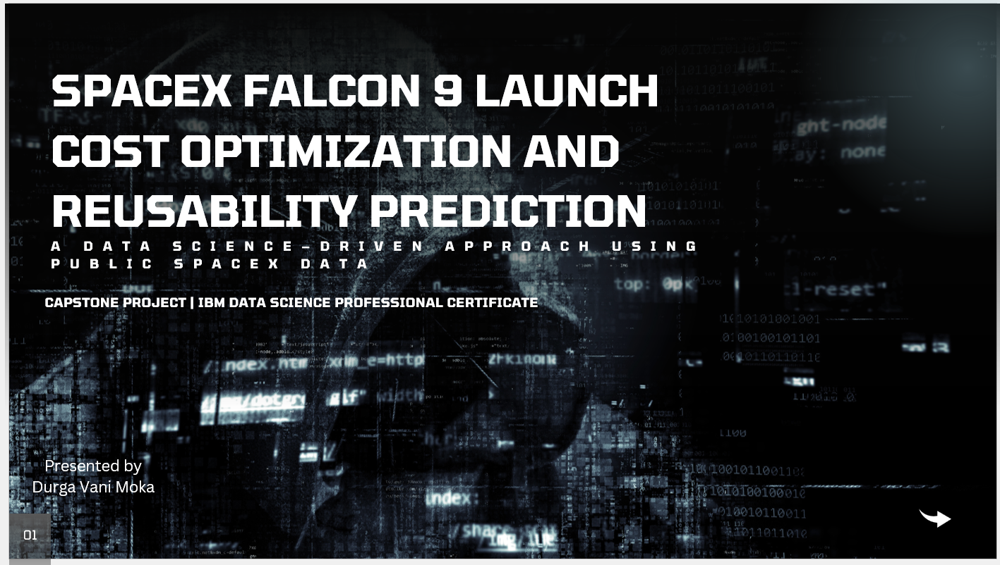
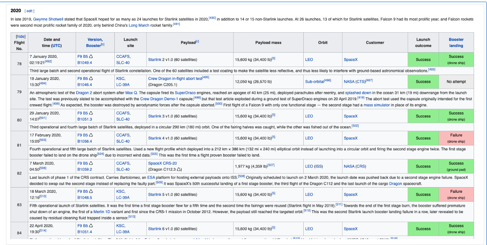

# 🚀 SpaceX Falcon 9 First-Stage Landing Prediction

## 📌 Project Overview
This project predicts whether the **Falcon 9 first-stage booster will land successfully**. Booster reusability is a major reason behind SpaceX’s lower launch costs compared to other providers. By predicting landing success, we can estimate launch costs and support competitive bidding strategies.

Falcon 9 first stage will land successfully

Several examples of an unsuccessful landing are shown here:

*Disclaimer: Images used in this project are sourced from publicly available
web resources and are included for educational purposes only. This project
is not affiliated with or endorsed by SpaceX.*

More specifically, the launch records are stored in a HTML table shown below:

.

---

## 🎯 Objective
Build a **classification model** to predict Falcon 9 first-stage landing success using historical launch data.

---

## 📊 Data Sources
- SpaceX Wikipedia  
- SpaceX Public APIs  

The dataset was cleaned, filtered to include **only Falcon 9 launches**, and a **binary target variable** (successful / unsuccessful landing) was created.

---

## 🛠️ Tools & Technologies
Python, Pandas, NumPy, Matplotlib, Seaborn, Scikit-learn, Folium, Plotly Dash, Jupyter Notebook,Folium

---

## 🔍 Workflow
Data Collection → Data Wrangling → EDA → Geospatial Analysis → Modeling → Evaluation → Results

---

## 🤖 Models Used
- Logistic Regression  
- Decision Tree  
- Random Forest
- SVM
- KNN 

---

## 🧑‍💻 Author
**Durga Vani Moka**  
IBM Data Science Professional Certificate – Capstone Project

